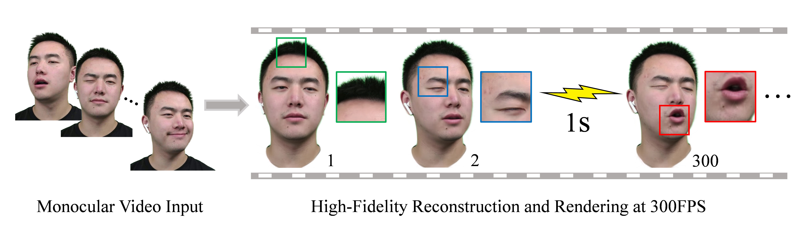

# FlashAvatar
**[Paper](https://arxiv.org/abs/2312.02214)|[Project Page](https://ustc3dv.github.io/FlashAvatar/)**


Given a monocular video sequence, our proposed FlashAvatar can reconstruct a high-fidelity digital avatar in minutes which can be animated and rendered over 300FPS at the resolution of 512×512 with an Nvidia RTX 3090.

## Setup

### Supported environment (128 branch)

This branch is maintained for modern PyTorch / CUDA stacks.

| Component | Version |
|---|---|
| OS | Ubuntu 22.04 (other Linux distros likely work) |
| Python | 3.11 |
| PyTorch | 2.9.1 (torchvision 0.24.1) |
| CUDA Toolkit | 12.8 (system-installed, `nvcc` on PATH) |
| GCC | gcc-11 / g++-11 (required by the CUDA extensions) |
| GPU | RTX 30 / 40 / 50 / Hopper class (sm_86 / sm_89 / sm_90 / sm_120 etc.) |

Support for PyTorch 2.12 + CUDA 13.0 / 13.2 is planned as a follow-up once
PyTorch 2.12 is released.

### Install (pip-only)

0. Prerequisites on the host:

   ```bash
   sudo apt install -y gcc-11 g++-11
   # Install CUDA Toolkit 12.8 system-wide so that nvcc is available,
   # then export CUDA_HOME if it is not at /usr/local/cuda-12.8 already.
   export CUDA_HOME=/usr/local/cuda-12.8
   export PATH=$CUDA_HOME/bin:$PATH
   ```

1. Create a Python 3.11 virtual environment and activate it:

   ```bash
   python3.11 -m venv .venv
   source .venv/bin/activate
   ```

2. Initialize git submodules (diff-gaussian-rasterization / simple-knn):

   ```bash
   git submodule update --init --recursive
   ```

3. Run the install script. It mirrors MTamon/DECA128/install_128.sh, installs
   the pinned dependency set from `requirements_128.txt`, builds pytorch3d
   v0.7.8 from source, and builds the two local CUDA extensions under
   `submodules/`:

   ```bash
   bash install_128.sh
   ```

The script sanity-checks the environment at the end (torch, pytorch3d,
diff_gaussian_rasterization, simple_knn).

#### Troubleshooting the CUDA extension builds

If `pip install ./submodules/diff-gaussian-rasterization` or
`./submodules/simple-knn` fail against PyTorch 2.9.1 / CUDA 12.8, first try:

- Double-check `nvcc --version` reports 12.8 and is actually the one on PATH.
- Make sure `TORCH_CUDA_ARCH_LIST` is set to the arch list of your local GPU
  (the script defaults to `7.5;8.0;8.6;8.9;9.0;12.0`; you can narrow it to
  your own GPU to speed up the build, e.g. `12.0` for an RTX 5090).
  Check your compute capability with:
  `nvidia-smi --query-gpu=compute_cap --format=csv,noheader`
- Re-run with verbose output: `pip install -v --no-deps ./submodules/simple-knn`.

If the build still fails, save the full compiler log and report back; the
expected follow-up is to apply targeted patches (API deprecations, GLM header
fixes) in a follow-up commit on this same branch.

### Legacy conda environment (original FlashAvatar, for reference only)

The original FlashAvatar environment targeted CUDA 11.6 / PyTorch 1.12.1 /
Python 3.7.13 and is kept around for reproducibility of the upstream paper:

```
conda env create --file environment.yml
conda activate FlashAvatar
conda install -c fvcore -c iopath -c conda-forge fvcore iopath
conda install -c bottler nvidiacub
conda install pytorch3d -c pytorch3d
```

This path is no longer actively maintained.

### FLAME model assets (required before training)

FlashAvatar uses the [FLAME](https://flame.is.tue.mpg.de/) 3D morphable
model.  Two asset files are **not** included in this repository (license
restrictions) and must be downloaded manually.

1. Register at https://flame.is.tue.mpg.de/ and accept the license.
2. Download **FLAME 2020** and extract `generic_model.pkl`:

   ```bash
   cp /path/to/FLAME2020/generic_model.pkl flame/generic_model.pkl
   ```

3. On the same download page, download **FLAME Vertex Masks**
   (`FLAME_masks.zip`).  Note: the zip extracts its contents **flat** (no
   subdirectory is created), so create the target directory first:

   ```bash
   mkdir -p flame/FLAME_masks
   cd flame/FLAME_masks
   unzip /path/to/FLAME_masks.zip    # yields FLAME_masks.pkl, FLAME_masks.gif, readme
   cd ../..
   ```

After this step the following files must exist:

```
flame/
├── generic_model.pkl          # FLAME 2020 model
├── FLAME_masks/
│   └── FLAME_masks.pkl        # vertex region masks
├── FlameMesh.obj              # (already in repo)
├── landmark_embedding.npy     # (already in repo)
├── blendshapes/               # (already in repo)
│   ├── l_eyelid.npy
│   └── r_eyelid.npy
└── mediapipe/                 # (already in repo)
    └── mediapipe_landmark_embedding.npz
```

## Data Convention

FlashAvatar needs four data components per identity, split across two
directory trees.  The `--idname` you pass to `train.py` / `test.py` must
match a name that appears in **both** `dataset/` and
`metrical-tracker/output/`.

```
dataset/
└── <id_name>/
    ├── imgs/           # video frames (JPEG, RGB)
    │   ├── 00001.jpg   # ← numbering starts at 1, NOT 0
    │   ├── 00002.jpg
    │   └── ...
    ├── parsing/        # semantic segmentation masks (PNG, binary 0/255)
    │   ├── 00001_neckhead.png
    │   ├── 00001_mouth.png
    │   ├── 00002_neckhead.png
    │   ├── 00002_mouth.png
    │   └── ...
    └── alpha/          # foreground opacity masks (JPEG, grayscale 0–255)
        ├── 00001.jpg
        ├── 00002.jpg
        └── ...

metrical-tracker/
└── output/
    └── <id_name>/
        └── checkpoint/     # FLAME tracking output (.frame files)
            ├── 00000.frame # ← numbering starts at 0
            ├── 00001.frame
            └── ...
```

> **Frame numbering offset**: the tracker uses 0-based indexing
> (`00000.frame`) while video frames use 1-based indexing (`00001.jpg`).
> This is handled internally (`frame_delta = 1`).  Tracker frame N
> corresponds to `imgs/{N+1:05d}.jpg`.

### Train / test split

- **Training**: frames 0 to `min(10000, N_frames − 500)`
- **Test** (used by `test.py`): last 500 frames
- At least ~600 frames are recommended for a meaningful split.

### Preparing your own data

To train FlashAvatar on a custom face, you need:

1. A **monocular face video** (front-facing, relatively stable lighting)
2. A **FLAME tracker** (metrical-tracker / MICA) to estimate per-frame
   FLAME parameters and camera poses
3. A **semantic segmentation model** to produce head/mouth masks
4. A **portrait segmentation model** (or matting model) to produce alpha
   masks

#### Automated pipeline

A ready-to-run pipeline is provided in `preprocess/`. All three stages
run in the same FlashAvatar env — the tracker uses the
[MTamon/metrical-tracker@claude0420](https://github.com/MTamon/metrical-tracker/tree/claude0420)
fork (FLAME pose/expression tracker) and the
[MTamon/MICA@claude/cuda128-pytorch29-update-ZxnsN](https://github.com/MTamon/MICA/tree/claude/cuda128-pytorch29-update-ZxnsN)
fork (FLAME shape predictor — produces `identity.npy`). Both share
FlashAvatar's pin set (torch 2.9.1 / CUDA 12.8):

```bash
# 1. extract + BiSeNet parsing + RVM matting
python scripts/preprocess.py prepare --idname myface --video my.mp4

# 2. tracker (one-time setup clones tracker + MICA and grabs FLAME / MICA assets)
bash scripts/setup_metrical_tracker.sh
bash scripts/run_tracker.sh myface   # auto-runs MICA if identity.npy missing

# 3. crop/resize + K/img_size adjustment
python scripts/preprocess.py finalize --idname myface --crop
```

`--crop` / `--no-crop` (on `finalize`) only affects the final square crop
and the camera `K` rewrite; parsing, matting and the tracker never rerun
when the crop flag changes. See [docs/preprocessing.md](docs/preprocessing.md)
for the full design, checkpoint locations and coordinate-system contract.
The remaining sections below describe the same steps performed manually.

##### Robust tracker: SMIRK (optional)

metrical-tracker's per-frame optimization becomes unstable on videos
with large head rotation or motion blur. For those, swap it for
[SMIRK](https://github.com/MTamon/smirk), a feed-forward FLAME encoder,
via the optional install:

```bash
bash scripts/setup_smirk.sh                       # one-time, opt-in
bash scripts/run_tracker.sh myface --smirk        # instead of plain run_tracker.sh
python scripts/preprocess.py finalize --idname myface --crop
```

SMIRK is NOT installed by `install_128.sh`; the SMIRK env lives entirely
under `external/smirk/` (except for a handful of shared Python packages
installed into FlashAvatar's venv). See [docs/smirk.md](docs/smirk.md)
for the compatibility matrix (exp 50 → 100 zero-pad, axis-angle → 6D
rot conversions, weak-perspective → perspective `K/R/t` via the internal
224 crop's similarity transform), caveats (no eye-ball rotation,
per-frame shape canonicalized by median), how to validate the install
by running SMIRK's own demos, and an env-compatibility note.

#### Step 1 — Extract video frames

```bash
mkdir -p dataset/myface/imgs
ffmpeg -i my_video.mp4 -q:v 2 -start_number 1 dataset/myface/imgs/%05d.jpg
```

Frames must be 5-digit zero-padded JPEG, starting from `00001.jpg`.

#### Step 2 — Run the FLAME tracker (metrical-tracker)

The tracker produces one `.frame` file per input frame, each containing:

| Key | Shape | Description |
|-----|-------|-------------|
| `flame.shape` | `(1, 300)` | FLAME shape params (shared across all frames) |
| `flame.exp` | `(1, 100)` | Expression params |
| `flame.jaw` | `(1, 6)` | Jaw pose (6D rotation) |
| `flame.eyes` | `(1, 12)` | Eye pose (left+right, 6D each) |
| `flame.eyelids` | `(1, 2)` | Eyelid blend weights |
| `opencv.K` | `(1, 3, 3)` | Camera intrinsic matrix |
| `opencv.R` | `(1, 3, 3)` | Camera rotation (world→camera) |
| `opencv.t` | `(1, 3)` | Camera translation |
| `img_size` | `(w, h)` | Original frame resolution |

```bash
# Example (exact command depends on your tracker version):
cd /path/to/metrical-tracker
python tracker.py --input_dir /path/to/FlashAvatar128-/dataset/myface/imgs \
                  --output_dir /path/to/FlashAvatar128-/metrical-tracker/output/myface
```

Output: `metrical-tracker/output/myface/checkpoint/00000.frame`, `00001.frame`, ...

#### Step 3 — Generate semantic masks (parsing)

Two binary masks per frame are required:

| Filename pattern | Region | Used for |
|---|---|---|
| `XXXXX_neckhead.png` | Head + neck silhouette | Compositing GT onto background |
| `XXXXX_mouth.png` | Mouth interior | 40× weighted loss on mouth region |

Format: single-channel PNG, pixel values 0 (background) or 255 (foreground).

You can produce these with any face-parsing model (e.g. BiSeNet,
face-parsing.PyTorch, or the tracker's own mask output if available):

```python
# Pseudo-code
for i, frame_path in enumerate(sorted(glob("dataset/myface/imgs/*.jpg"))):
    img = load(frame_path)
    seg = face_parsing_model(img)          # per-pixel class labels
    head = ((seg == HEAD) | (seg == NECK)).astype(np.uint8) * 255
    mouth = (seg == MOUTH).astype(np.uint8) * 255
    fname = f"{i+1:05d}"
    save_png(head,  f"dataset/myface/parsing/{fname}_neckhead.png")
    save_png(mouth, f"dataset/myface/parsing/{fname}_mouth.png")
```

#### Step 4 — Generate alpha masks

Foreground opacity per frame. 255 = person, 0 = background.

```bash
mkdir -p dataset/myface/alpha
```

Options:
- Portrait matting model (e.g. RobustVideoMatting, MODNet)
- Green-screen keying
- The tracker may provide a foreground mask

Output: `dataset/myface/alpha/00001.jpg`, `00002.jpg`, ... (JPEG,
grayscale, same resolution as frames).

#### Step 5 — Verify and train

```bash
# Check file counts match
ls dataset/myface/imgs/    | wc -l   # N frames
ls dataset/myface/alpha/   | wc -l   # N frames
ls dataset/myface/parsing/ | wc -l   # 2 × N (neckhead + mouth per frame)
ls metrical-tracker/output/myface/checkpoint/ | wc -l  # N .frame files

# Train (short run first)
python train.py --idname myface --iterations 5000

# Full quality
python train.py --idname myface --iterations 150000

# Generate test video
python test.py --idname myface \
    --checkpoint dataset/myface/log/ckpt/chkpnt150000.pth
# → dataset/myface/log/test.avi
```
## Running

### Quick start with the example data

Download the [example](https://drive.google.com/file/d/1_WLvlmHD73jOAO178N7eX5UQqlrL2ghD/view?usp=drive_link)
with pre-processed data and pre-trained model.  Extract it so that **both**
`dataset/<id_name>/` and `metrical-tracker/output/<id_name>/checkpoint/` exist.
The `--idname` you pass must match a name that appears in both directories.

For example, the download contains an `Obama` sequence:

```
dataset/Obama/          ← video frames, parsing, alpha
metrical-tracker/output/Obama/checkpoint/   ← .frame files (FLAME params)
```

- **Training (short run for verification)**
```shell
python train.py --idname Obama --iterations 5000
```

- **Training (full quality)**
```shell
python train.py --idname <id_name>
```

- **Evaluating pre-trained model**
```shell
python test.py --idname <id_name> --checkpoint dataset/<id_name>/log/ckpt/chkpnt.pth
```

Output video is saved to `dataset/<id_name>/log/test.avi`.

## Citation
```
@inproceedings{xiang2024flashavatar,
      author    = {Jun Xiang and Xuan Gao and Yudong Guo and Juyong Zhang},
      title     = {FlashAvatar: High-fidelity Head Avatar with Efficient Gaussian Embedding},
      booktitle = {The IEEE Conference on Computer Vision and Pattern Recognition (CVPR)},
      year      = {2024},
  }
```
